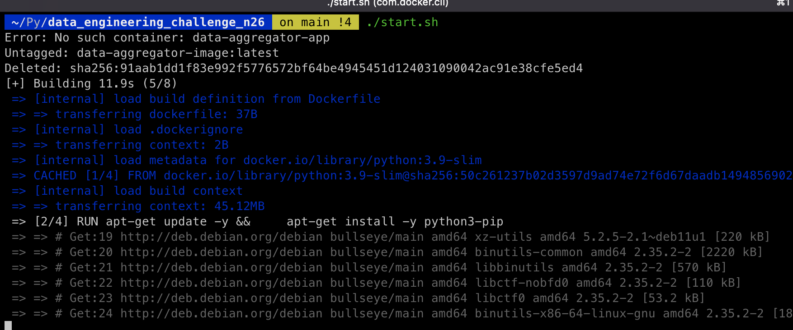
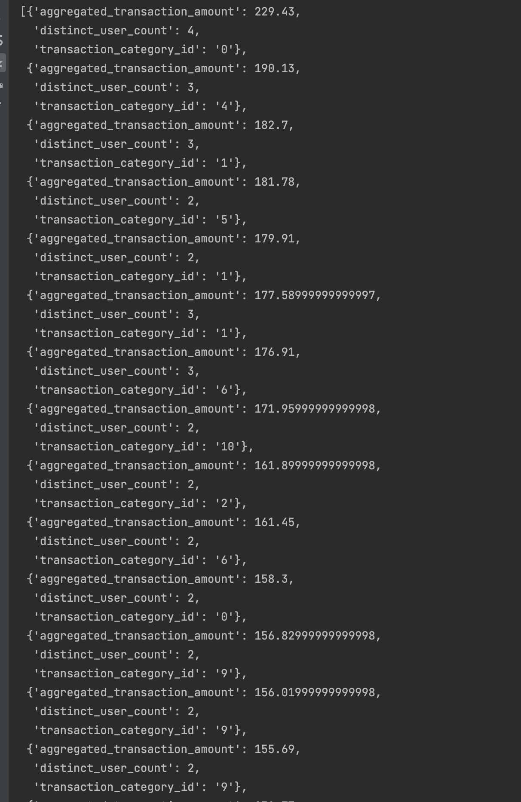

# Data Aggregator

# Overview:
A python language  based data aggregator that leverages the core libraries to produce an output based on the provided CSV files

# Requirement
Develop a Python program using only the Python Standard Library which reads data from CSV files , and computes the equivalent result of the SQL query in an efficient way that would be scalable for large data sets as well.

# Language/Tools/Framework used
* Python 3.9
* Docker

# What can be done better
* Accept the csv files as command line arguments or access via yaml file
* More generic handling of filter and aggregation queries
* Introducing multithreading for enhanced scalability.

# Steps to run the Application
After having successfully downloaded the application, please go to the root directory of the app. In this case it's _data_engineering_challenge_n26_
## Option - 1 : With Docker( Recommended)
* Once in the root directory of the app, Run the below command to get execution access to the shell script 
`chmod +x start.sh`
* Ensure docker is installed on the machine. If not please follow the steps [here](https://docs.docker.com/desktop/install/mac-install/) to do so
* Once docker is installed, you can now run the app using `./start.sh`. This will internally create a docker image, run all tests, spin up the container and print the logs on the terminal.

## Option - 2 : With Installed Python
* If you haven't installed python on your machine yet, please make sure you follow the steps to do so [here](https://docs.python.org/3.9/using/mac.html)
* Once pythong has been successfully installed, go into the root of the app directory and run `python3 entrypoint.py`
* This will print out all the out put on the command line terminal

## Option - 3: With  Pycharm IDE
* If you are using an IDE to run the app, make sure the project is imported into the IDE.
* Once successfully imported it will prompt you to configure a python interpreter. On this step you can either use your installed python mentioned in Option-2 or configure the python virtual environment.
* In both cases, the IDE will have a play button next to the `__main__` method in entrypoint.py file
* In addition to that, you can also run all the test by running all the methods in the **tests/test_data_processor.py** file

# Screenshots
### Docker Setup : 

### Sample Output

# Sql (Task-2):
The second assignment can be found in the sql file [here](sql_tasks/task_2_feature_table_computation.sql) and the detailed follow up questions are answered [here](sql_tasks/task_2_feature_table_computation.md)

# Sql (Task-3):
The third assignment can be found in the sql file [here](sql_tasks/task_3_dimension_deduplication.sql) and the detailed follow up questions are answered [here]()

 
